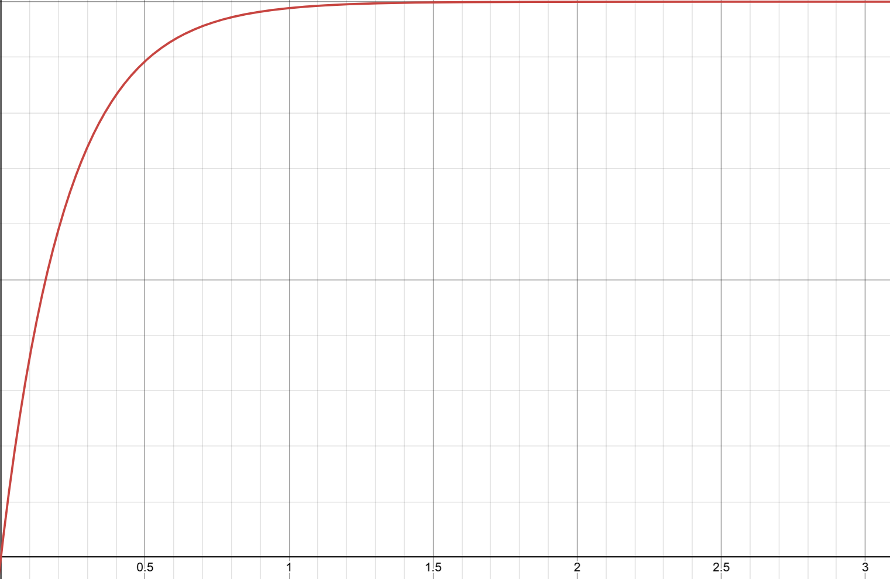

Nebulous.io의 질량점수는 5이상의 실수 값을 가진다. 플레이어에게는 정수로만 보이지만, 분열 및 방출 등으로 정수가 아닌 수가 될 수 있다.
5미만의 점수는 5점으로 자동으로 올림 처리된다.


## 질량의 값은 즉시 변하지 않는다
만약 점수 변화가 있을 때마다 방울의 크기가 즉시 변한다면 어떻게 될까?


100점에서 175점이 되는 과정을 담은 gif이다.

질량이 즉시 변한다면 왼쪽처럼 부자연스럽게 끊기듯이 보인다. 실제 게임에서는 오른쪽처럼 질량이 점진적으로 반영된다.

방울의 크기가 즉시 변한다면 이렇게 먹이를 하나 먹을 때마다 크기가 순간적으로 튀고, 상대를 흡수하거나 방출할 때도 몸집이 뚝뚝 끊겨 보일 것이다.  
이렇게 되면 화면상 움직임이 부자연스럽고, 플레이어 입장에서도 크기 변화가 갑작스럽게 느껴진다.

그래서 이 게임은 질량 변화를 바로 몸집에 적용하지 않고, 두 단계로 나누어 처리한다.

- 먼저, 질량 변화 이벤트가 발생하면 목표가 되는 질량값이 즉시 바뀐다.
- 이후 실제 몸집에 반영되는 질량값이 그 목표를 향해 점진적으로 따라간다.

편의상 전자를 `targetMass`, 후자를 `smoothMass`라고 부르겠다.

* **targetMass**: 실제로 도달해야 하는 목표 질량
* **smoothMass**: 화면에 점진적으로 반영되는 질량

즉, 어떤 이벤트로 인해 질량이 변하면 먼저 `targetMass`가 바뀌고, 이후 `smoothMass`가 여러 틱에 걸쳐 그 값을 따라간다.

## targetMass와 smoothMass

### targetMass

`targetMass`는 **목표 질량**이다.  
먹이를 먹거나, 다른 방울을 흡수하거나, 질량이 감소하는 이벤트가 발생하면 우선 이 값이 즉시 변한다.

예를 들어 다음과 같은 상황에서 `targetMass`가 먼저 변한다.

* 도트 먹기
* 먹이 흡수
* 다른 플레이어 흡수
* 질량 감소
* 홀 효과
* 분열 후 질량 분배
* 먹이 방출
* 1000점 이상에서 질량 감쇠

### smoothMass

`smoothMass`는 **현재 몸집에 반영된 질량**이라고 생각하면 된다.  
이 값은 `targetMass`를 즉시 따라가지 않고, 매 틱(0.05초)마다 조금씩 가까워진다.

게임은 이 값을 바탕으로 반지름을 계산하고, 그 반지름을 화면 표시와 충돌/흡수 판정 등에 사용한다.

쉽게 말하면, 점수는 먼저 바뀌고, 몸집은 잠깐 늦게 따라온다.

---

## `smoothMass`가 `targetMass`를 따라가는 방식

질량 변화는 즉시 반영되지 않고, 매 틱마다 `smoothMass`가 `targetMass`를 조금씩 따라가는 방식으로 처리된다.

매 틱마다 다음과 같은 보간이 일어난다.

```math
\text{smoothMass}_{\text{next}}
=
\text{smoothMass}_{\text{now}}
+
0.2\left(\text{targetMass} - \text{smoothMass}_{\text{now}}\right)
```

즉, 매 틱마다 `smoothMass`는 `targetMass`까지 남은 차이의 20%만큼 이동한다.

이를 차이값 기준으로 보면 더 단순해진다.  
현재 차이를 `gap`이라고 하면:

```math
\text{gap}_{\text{now}}
=
\text{targetMass} - \text{smoothMass}_{\text{now}}
```

다음 틱의 차이는 다음과 같다.

```math
\text{gap}_{\text{next}}
=
0.8 \cdot \text{gap}_{\text{now}}
```

즉, 한 틱이 지날 때마다 남은 차이는 기존의 80%로 줄어든다.

따라서 `n`틱 후 남은 차이는 다음과 같다.

```math
\text{gap}_n
=
0.8^n \cdot \text{gap}_0
```

반대로, `n`틱 후 목표 질량이 실제로 반영된 비율은 다음과 같다.

```math
\text{reflectedRatio}_n
=
1 - 0.8^n
```

예를 들어 10틱이 지나면:

```math
\text{reflectedRatio}_{10}
=
1 - 0.8^{10}
\approx 0.8926
```

즉, 10틱 후에는 목표 질량 변화량의 약 <strong>89.3%</strong>가 반영된다.

---

## 틱 단위 반영률

이 게임은 **초당 20틱**으로 동작한다.  
즉, 1틱은 0.05초(50ms)이다.

|경과 시간|틱 수|반영률|
|-|-:|-:|
|0.05초|1틱|20.0%|
|0.10초|2틱|36.0%|
|0.15초|3틱|48.8%|
|0.25초|5틱|67.2%|
|0.50초|10틱|89.3%|
|0.75초|15틱|96.5%|
|1.00초|20틱|98.8%|
|1.50초|30틱|99.88%|

완전히 같아지는 데는 이론적으로 시간이 걸리지만, 실제 게임에서는 오차가 충분히 작아지면 `smoothMass = targetMass`로 스냅된다.  
또한 0.5초만 지나도 이미 약 90%가 반영되므로, 체감상으로는 생각보다 빠르게 목표 크기에 가까워진다.



시간(초)에 따른 반영률. 1초가 지나면 98.8%에 달하여 거의 반영된다고 볼 수 있다.

---

## 질량 변화 예시: 100점 → 175점

예를 들어, 어떤 이벤트로 인해 100점인 방울이 175점이 되어야 한다고 하자.

이때 내부 상태는 다음처럼 진행된다.

* 이벤트 발생 즉시: `targetMass = 175`
* 하지만 `smoothMass`는 바로 175가 되지 않고 천천히 따라감

초기 상태:

```text
targetMass = 175
smoothMass = 100
```

틱별 변화:

|틱|smoothMass|
|-:|-:|
|0|100.0000|
|1|115.0000|
|2|127.0000|
|3|136.6000|
|4|144.2800|
|5|150.4240|
|6|155.3392|
|7|159.2714|
|8|162.4171|
|9|164.9337|
|10|166.9469|

즉, 0.5초(10틱)만 지나도 이미 175점에 상당히 가까워진다.

---


## 예시: 언제 120점을 먹을 수 있는가?

예를 들어 다음 상황을 생각해보자.

* 내 방울의 현재 질량: 100점
* 어떤 이벤트로 목표 질량이 175점으로 증가
* 상대방 질량: 120점

중요한 점은, **100점이 175점이 되는 순간 즉시 120점을 먹을 수 있는 것이 아니라는 것**이다.

흡수 조건은 `targetMass`가 아니라, 그 시점의 실제 반영 질량인 `smoothMass`에 대응하는 질량으로 판단되기 때문이다.

즉:

* 이벤트 직후 바로 먹는 것이 아니라
* `smoothMass`가 충분히 커진 뒤에야
* 상대 120점을 흡수할 수 있게 된다

이 게임에는 질량 변화에 대한 **지연(delay)** 이 존재한다고 볼 수 있다.

---

## 흡수 조건식

플레이어 간 흡수는 단순히 “상대보다 크면 먹는다”가 아니다.  
실제로는 상대 방울의 질량에 따라, 먹기 위해 필요한 최소 질량이 따로 정해진다.

작은 방울의 질량을 $m_{\text{small}}$, 큰 방울의 질량을 $m_{\text{big}}$이라고 하면, 흡수 조건은 다음과 같이 쓸 수 있다.

```math
m_{\text{big}} > 1.1025m_{\text{small}} + 1.575\sqrt{m_{\text{small}}} + 0.5625
```

즉, 상대의 질량이 $m_{\text{small}}$일 때, 그 상대를 먹기 위해 필요한 최소 질량은 다음과 같다.

```math
m_{\text{required}} = 1.1025m_{\text{small}} + 1.575\sqrt{m_{\text{small}}} + 0.5625
```

예를 들어 상대의 질량이 120점이라면:

```math
m_{\text{required}} = 1.1025 \cdot 120 + 1.575\sqrt{120} + 0.5625 \approx 150.15
```

따라서 120점 상대를 먹으려면 단순히 121점만 되어서는 부족하다.  
현재 판정 질량이 약 **150.1점 이상**이어야 흡수할 수 있다.

상대 질량별 필요한 최소 질량은 대략 다음과 같다.


| 상대 질량 m<sub>small</sub> | 필요한 최소 질량 m<sub>required</sub> |
|---:|---:|
| 100 | 126.56 |
| 200 | 243.43 |
| 300 | 358.67 |
| 400 | 473.06 |
| 500 | 586.98 |
| 1000 | 1152.87 |
| 2000 | 2276.36 |
| 3000 | 3396.34 |
| 4000 | 4514.13 |
| 5000 | 5630.35 |
---

## 100점 → 175점일 때 120점을 먹는 시점

`smoothMass\_n`은 다음과 같이 쓸 수 있다.


$$smoothMass\_n = 175 - (175 - 100) \* 0.8^n$$
             $$= 175 - 75 \* 0.8^n$$


이 값이 150.1 이상이 되면 120점 상대를 먹을 수 있다.

|틱|시간|smoothMass|120점 흡수|
|-:|-:|-:|-|
|0|0.00초|100.00|불가능|
|1|0.05초|115.00|불가능|
|2|0.10초|127.00|불가능|
|3|0.15초|136.60|불가능|
|4|0.20초|144.28|불가능|
|5|0.25초|150.42|가능|
|10|0.50초|166.95|가능|
|20|1.00초|174.14|가능|

즉, 이 경우 질량 상승 이벤트 후 **약 0.25초가 지나야** 120점을 흡수할 수 있다.

---

## 작은 질량 변화는 거의 즉시 반영된다고 봐도 되는가?

실전 체감상, 작은 질량 변화는 거의 즉시 반영되는 것처럼 느껴진다.

예:

* 도트 1개 먹기
* 소량 방출
* 큰 점수에서의 완만한 감쇄

이론상으로는 작은 변화도 동일하게 `smoothMass` 지연을 거친다.  
하지만 변화폭이 작으면 질량 변화도 매우 작기 때문에 눈으로 체감하기 어렵다.

반대로 다음 상황에서는 지연이 실제 플레이에 영향을 줄 수 있다.

* 홀 보상처럼 한 번에 큰 질량을 얻는 경우
* 상대를 흡수해서 질량이 크게 증가하는 경우
* 먹이 방출이나 분열로 질량이 크게 감소하는 경우
* 흡수 조건 컷 근처에 있는 경우
* 홀 터짐 기준인 약 245점 근처에 있는 경우
* 분열 가능 기준인 20점 근처에 있는 경우

요약하면:

> 작은 변화는 거의 즉시처럼 보이지만, 큰 변화나 판정 컷 근처에서는 `smoothMass` 지연이 실제 플레이에 영향을 줄 수 있다.

---

## 분열할 때도 점진 반영되는가?

분열은 일반적인 질량 증가와 다르게 처리된다.  
먹이를 먹거나 상대를 흡수할 때는 `targetMass`가 먼저 변하고 `smoothMass`가 이를 따라가지만, 분열은 예외적으로 질량과 반지름이 즉시 재설정된다.

기본적으로 100점 방울이 분열하면:

```text
부모 targetMass = 50
부모 smoothMass = 50

자식 targetMass = 50
자식 smoothMass = 50
```
---

## 어떤 값이 어디에 쓰이는가?

|상황|주로 쓰이는 값|설명|
|-|-|-|
|먹이 섭취|`targetMass`|먹은 질량이 즉시 더해짐|
|상대 셀 흡수|`targetMass`|상대의 질량을 즉시 획득|
|분열|`targetMass`|부모 셀의 질량을 자식 셀에 분배|
|먹이 방출|`targetMass`|방출한 만큼 장부상 질량 감소|
|대시 비용|`targetMass`|대시 시 질량 감소|
|큰 질량 감쇠|`targetMass`|일정 질량 이상에서 지속 감소|
|반지름 계산|`smoothMass`|`radius = sqrt(smoothMass)`|
|화면상 크기|`smoothMass`|실제로 보이는 몸집|
|충돌 판정|`smoothMass` 기반 반지름|원-원 충돌 계산|
|흡수 판정|`smoothMass` 기반 반지름|실제 반영된 크기로 판정|
|분열 가능 여부|`smoothMass`|`smoothMass >= 20`|
|홀 터짐 기준|`smoothMass`|`radius >= 15.65`, 즉 244.9225 이상|
|이동 속도|`smoothMass` 기반 반지름|몸집이 커질수록 느려짐|

---
## 1000점 이상 자연 감쇠

셀의 `targetMass`가 1000점을 초과하면 자연 감쇠가 발생한다.

이 감쇠는 `smoothedMass`를 직접 깎는 것이 아니라, 먼저 `targetMass`를 감소시킨다.  
그 후 `smoothedMass`가 감소한 `targetMass`를 따라가고, 이에 따라 반지름과 이동 속도도 다시 계산된다.

흐름은 다음과 같다.

1. `targetMass`가 1000 초과인지 확인한다.
2. 1000을 초과했다면 `targetMass`를 감소시킨다.
3. `smoothedMass`가 감소한 `targetMass`를 따라간다.
4. `smoothedMass` 기준으로 반지름이 다시 계산된다.
5. 반지름 기준으로 이동 속도도 다시 계산된다.

일반 감쇠 공식은 다음과 같다.

<p align="center">
decay = √(targetMass - 1000) × dt / 10
</p>

<p align="center">
targetMass<sub>new</sub> = targetMass - decay
</p>

20 TPS 기준으로 `dt = 0.05`라고 하면, 1 tick당 감소량은 다음과 같다.

<p align="center">
decayPerTick = 0.005 × √(targetMass - 1000)
</p>

1초당 감소량은 대략 다음과 같다.

<p align="center">
decayPerSecond = 0.1 × √(targetMass - 1000)
</p>

즉 1000점을 넘으면 점수가 자연적으로 줄어들지만, 감소량은 전체 질량에 비해 매우 완만하다.

| targetMass | 1000 초과분 | 일반 모드 1초 감소량 |
|---:|---:|---:|
| 1000 | 0 | 0 |
| 1100 | 100 | 약 1.00 |
| 1500 | 500 | 약 2.24 |
| 2000 | 1000 | 약 3.16 |
| 3000 | 2000 | 약 4.47 |
| 5000 | 4000 | 약 6.32 |
| 10000 | 9000 | 약 9.49 |
| 20000 | 19000 | 약 13.78 |
| 50000 | 49000 | 약 22.14 |
| 100000 | 99000 | 약 31.46 |

---

### 원 / 트릭 모드의 5000점 이상 강한 감쇠

원(Circle) 모드와 트릭(Trick) 모드에서는 `targetMass`가 5000점 이상일 때 더 강한 감쇠가 적용된다.

| modeId | 모드 |
|---:|---|
| 19 | 원(Circle) |
| 24 | 트릭(Trick) |

원 / 트릭 모드에서 5000점 이상일 때 감쇠 공식은 다음과 같다.

<p align="center">
decay = 2 × dt × √(targetMass - 1000)
</p>

20 TPS 기준으로 `dt = 0.05`이므로, 1 tick당 감소량은 다음과 같다.

<p align="center">
decayPerTick = 0.1 × √(targetMass - 1000)
</p>

1초당 감소량은 대략 다음과 같다.

<p align="center">
decayPerSecond = 2 × √(targetMass - 1000)
</p>

이는 일반 감쇠보다 약 20배 강하다.

| targetMass | 일반 모드 1초 감소량 | 원 / 트릭 1초 감소량 |
|---:|---:|---:|
| 1000 | 0 | 0 |
| 1100 | 약 1.00 | 약 1.00 |
| 1500 | 약 2.24 | 약 2.24 |
| 2000 | 약 3.16 | 약 3.16 |
| 3000 | 약 4.47 | 약 4.47 |
| 5000 | 약 6.32 | 약 126.49 |
| 10000 | 약 9.49 | 약 189.74 |
| 20000 | 약 13.78 | 약 275.68 |
| 50000 | 약 22.14 | 약 442.72 |
| 100000 | 약 31.46 | 약 629.29 |

단, 원 / 트릭의 강한 감쇠는 5000점 이상에서만 적용된다.  
5000점 아래로 내려가면 다시 일반 감쇠 공식이 적용된다.

---

### 자연 감쇠로 1000점까지 내려가는 시간

아래 표는 추가 섭취나 방출 없이, 자연 감쇠만으로 `targetMass`가 1000점까지 내려가는 데 걸리는 시간을 계산한 것이다.

| 시작 targetMass | 일반 모드 | 원 / 트릭 모드 |
|---:|---:|---:|
| 1100 | 약 3분 20초 | 약 3분 20초 |
| 1500 | 약 7분 27초 | 약 7분 27초 |
| 2000 | 약 10분 32초 | 약 10분 32초 |
| 3000 | 약 14분 54초 | 약 14분 54초 |
| 5000 | 약 21분 5초 | 약 21분 4초 |
| 10000 | 약 31분 37초 | 약 21분 36초 |
| 20000 | 약 45분 57초 | 약 22분 19초 |
| 50000 | 약 73분 47초 | 약 23분 42초 |
| 100000 | 약 104분 53초 | 약 25분 15초 |

원 / 트릭 모드는 5000점 이상 구간에서 감쇠가 매우 강하다.  
하지만 5000점 아래부터는 일반 감쇠로 바뀌기 때문에, 최종적으로 1000점까지 내려가는 데는 여전히 시간이 오래 걸린다.

즉 원 / 트릭의 강한 감쇠는 “1000점까지 즉시 깎는 장치”라기보다는, 5000점 이상으로 지나치게 커진 셀을 빠르게 5000점 근처로 되돌리는 장치에 가깝다.

---

## 핵심 요약

* 질량 변화가 생기면 먼저 `targetMass`가 즉시 변한다.
* `smoothMass`는 매 틱 `targetMass`에 20%씩 가까워진다.
* 20틱/초 기준, 0.5초면 약 89%, 1초면 약 98.8% 반영된다.
* 반지름은 `$$sqrt(smoothMass)$$`로 계산된다.
* 흡수 판정은 단순 점수 비교가 아니라 실제 반영된 크기 기준이다.
* 따라서 큰 질량 변동 직후에는 “점수는 충분한데 아직 못 먹는” 상황이 발생할 수 있다.
