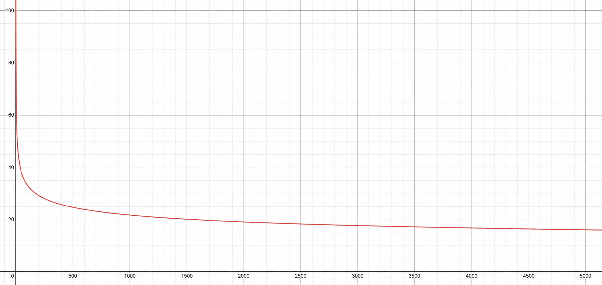

# 이동 속도와 맵 크기

## 1. 개요

이 게임에서 플레이어 셀의 이동 속도는 질량과 직접 연결되어 있다.

질량이 커질수록 셀의 반지름이 커지고, 반지름이 커질수록 이동 속도는 느려진다.  
하지만 질량이 조금 늘어난다고 속도가 급격히 줄어드는 것은 아니다.

이동 시스템은 크게 다음 요소로 나눌 수 있다.

- 질량
- 반지름
- 기본 이동 속도
- 맵 크기
- 맵 경계 처리
- 배경 격자

---

## 2. 질량과 반지름

셀의 반지름은 질량의 제곱근으로 계산된다.

$$
radius = \sqrt{mass}
$$

예시:

| 질량 | 반지름 |
|---:|---:|
| 5 | 약 2.236 |
| 20 | 약 4.472 |
| 100 | 10 |
| 320 | 약 17.889 |
| 1000 | 약 31.623 |
| 10000 | 100 |

즉 질량이 4배가 되면 반지름은 2배가 된다.

---

## 3. 이동 속도 공식

플레이어 셀의 기본 이동 속도는 반지름을 기준으로 계산된다.

$$
speed = \frac{\sqrt{5} \times 35}{radius^{0.37037036}}
$$

여기서:

$$
\sqrt{5} \times 35 \approx 78.2624
$$

그리고:

$$
radius = \sqrt{mass}
$$

이므로 질량 기준으로 바꾸면 다음과 같다.

$$
speed = \frac{78.2624}{mass^{0.18518518}}
$$

지수 \(0.18518518\)은 거의 다음 값과 같다.

$$
0.18518518 \approx \frac{5}{27}
$$

따라서 질량 기준 이동 속도는 다음처럼 정리할 수 있다.

$$
speed \approx \frac{78.2624}{mass^{5/27}}
$$

즉 질량이 커질수록 속도는 줄어들지만, 감소율은 매우 완만하다.

질량별 이동속도 그래프는 위와 같다.

---

## 4. 질량별 이동 속도 예시

| 질량 | 반지름 | 이동 속도 | 1 tick 이동량 |
|---:|---:|---:|---:|
| 5 | 약 2.236 | 약 58.09 | 약 2.90 |
| 20 | 약 4.472 | 약 44.94 | 약 2.25 |
| 100 | 10.00 | 약 33.36 | 약 1.67 |
| 320 | 약 17.89 | 약 26.89 | 약 1.34 |
| 1000 | 약 31.62 | 약 21.78 | 약 1.09 |
| 10000 | 100.00 | 약 14.22 | 약 0.71 |

1 tick은 0.05초로 계산했다.

$$
1 \text{ tick} = 0.05 \text{ sec}
$$

따라서 1 tick 이동량은 다음과 같다.

$$
\text{tickDistance} = speed \times 0.05
$$

---
## 5. 질량이 커질수록 얼마나 느려지는가?

이동 속도는 질량에 대해 다음과 같은 비례 관계를 가진다.

speed ∝ mass-5/27

따라서 질량이 k배가 되었을 때 속도 비율은 다음과 같다.

speednew / speedold = k-5/27

예를 들어 질량이 10배가 되면:

10-5/27 ≈ 0.653

즉 질량이 10배가 되어도 속도는 약 65.3% 수준으로 줄어든다.

| 질량 증가 배율 | 속도 비율 | 의미 |
|---:|---:|---|
| 2배 | 약 87.9% | 약 12.1% 감소 |
| 5배 | 약 74.2% | 약 25.8% 감소 |
| 10배 | 약 65.3% | 약 34.7% 감소 |
| 20배 | 약 57.4% | 약 42.6% 감소 |
| 42.2배 | 약 50.0% | 속도 절반 |
| 100배 | 약 42.6% | 약 57.4% 감소 |

---

## 6. 속도가 절반이 되려면 얼마나 커져야 하는가?

속도가 절반이 되려면 다음 조건을 만족해야 한다.

$$
k^{-5/27} = \frac{1}{2}
$$

이를 풀면:

$$
k = 2^{27/5}
$$

계산하면:

$$
k \approx 42.22
$$

즉 질량이 약 **42.2배** 커져야 속도가 절반이 된다.

예를 들어 100점 셀과 비교하면:

$$
100 \times 42.22 \approx 4222
$$

따라서 100점 셀의 속도가 절반 수준으로 줄어들려면 약 4200점대까지 커져야 한다.

---

## 7. 시작 크기

시작 셀의 기본 반지름은 다음 값으로 볼 수 있다.

$$
\sqrt{5}
$$

따라서 시작 질량은 다음과 같다.

$$
mass = 5
$$

즉 기본 시작 셀은 5점짜리 셀이라고 볼 수 있다.

---

## 8. 기본 맵 크기

기본 맵 크기는 시작 반지름 \(\sqrt{5}\)에 특정 상수 314.58을 곱한 값으로 계산된다.

$$
baseMapSize = 314.58 \times \sqrt{5}
$$

계산하면:

$$
baseMapSize \approx 703.42
$$

즉 기본 맵의 한 변 길이는 약 703.42 월드 유닛이다.

여기서 \(\sqrt{5}\)는 시작 셀의 기본 반지름과 연결되는 값이다.  
시작 셀의 질량은 5이고, 반지름은 다음과 같다.

$$
radius = \sqrt{5}
$$

---

## 9. 맵 크기 배율

맵 크기는 설정에 따라 배율이 달라진다.

| 맵 크기 | 배율 | 한 변 길이 |
|---|---:|---:|
| 초소형 | 0.5 | 약 351.71 |
| 소형 | 0.707 | 약 497.32 |
| 중형 / 기본 | 1.0 | 약 703.42 |
| 대형 | 1.2 | 약 844.11 |
| 초대형 | 1.5 | 약 1055.13 |

즉 초소형 맵은 기본 맵의 절반 크기이고, 초대형 맵은 기본 맵의 1.5배 크기이다.

---

## 10. 맵 경계 처리

셀은 맵 밖으로 나갈 수 없다.

맵 경계에 닿으면 위치가 맵 안쪽으로 보정된다.  
즉 셀의 중심이 맵 밖으로 완전히 나가는 것이 아니라, 셀 반지름을 고려해서 맵 안에 머물도록 제한된다.

개념적으로는 다음과 같다.

$$
x \ge x_{\min} + radius
$$

$$
x \le x_{\max} - radius
$$

$$
y \ge y_{\min} + radius
$$

$$
y \le y_{\max} - radius
$$

즉 큰 셀일수록 중심이 벽에 더 가까이 갈 수 없다.  
반지름이 크기 때문에, 중심 좌표는 벽에서 더 떨어진 위치까지만 이동할 수 있다.

---

## 11. 큰 셀의 맵 사용 가능 영역

셀 반지름이 커질수록 중심이 움직일 수 있는 영역은 줄어든다.

예를 들어 초소형 맵의 한 변 길이는 약 351.71이다.  
10000점 셀의 반지름은 100이므로, 중심 좌표는 각 벽에서 최소 100만큼 떨어져 있어야 한다.

따라서 중심이 움직일 수 있는 가로 길이는 대략:

$$
351.71 - 2 \times 100 = 151.71
$$

즉 셀 자체가 너무 크면 실제로 움직일 수 있는 중심 좌표 범위가 매우 좁아진다.

---

## 핵심 요약

- 셀 반지름은 $$\(radius = \sqrt{mass}\)$$로 계산된다.
- 이동 속도는 반지름이 커질수록 느려진다.
- 질량 기준 이동 속도는 대략 $$\(speed = 78.2624 / mass^{5/27}\)$$이다.
- 질량이 약 42.2배 증가해야 속도가 절반이 된다.
- 기본 시작 질량은 5점이고, 시작 반지름은 $$\(\sqrt{5}\)$$이다.
- 중형 맵 한 변 길이는 $$\(314.58\sqrt{5} \approx 703.42\)$$이다.
- 초소형, 소형, 대형, 초대형 맵은 이 기본 크기에 배율을 곱해 결정된다.
- 배경을 격자로 설정하면 맵 크기에 따라 9 × 9, 13 × 13, 20 × 20, 28 × 28 격자가 표시된다.
- 셀은 맵 밖으로 나갈 수 없고, 반지름을 고려해 경계 안쪽으로 제한된다.
